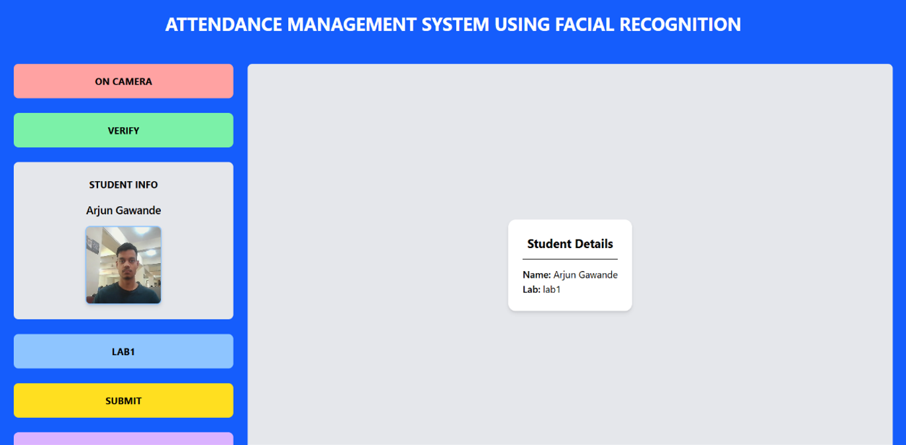
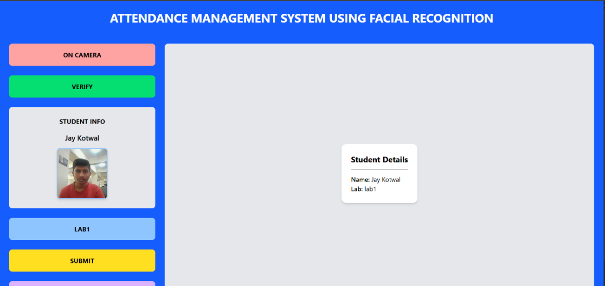

# Vision Attend – FastAPI Backend

**Vision Attend** is a real-time classroom attendance automation system powered by Siamese Neural Network and Triplet Loss.  
This backend handles camera streaming, face detection, and prediction.

🔗 **Project Demo:** *https://drive.google.com/file/d/1qpr7F8-5z8XtttxdQiyzODMN5TN0fmkq/view?usp=sharing*

## 📌 Features

- **Siamese Neural Network Architecture** – A scalable and lightweight deep learning approach ideal for real-time face recognition tasks.
- **Triplet Loss** – Enables efficient training even with limited data (proposed by Google in their FaceNet paper).
- **MTCNN for Face Detection** – A multi-stage detector known for high accuracy in detecting faces even under challenging lighting and angle variations.
- **FastAPI Backend** – High-performance Python web framework offering speed, automatic documentation, and asynchronous request handling.

## 🧰 Technologies Used

- **Backend Server:** FastAPI  
- **Face Detection:** MTCNN  
- **Real-Time Image Capturing:** OpenCV  
- **Face Recognition Model (Custom Siamese Architecture):** TensorFlow  

## ⚙️ Installation

1. **Clone the repository**
   ```bash
   git clone https://github.com/YNJ27/VisionAttend-FastAPI_server.git
   ```

2. **Create a virtual environment**
   ```bash
   python -m venv venv
   ```
   Activate it:
   - Windows:
     ```bash
     venv\Scripts\activate
     ```
   - macOS/Linux:
     ```bash
     source venv/bin/activate
     ```

3. **Install dependencies**
   ```bash
   pip install -r requirements.txt
   ```

4. **Navigate to the FastAPI server folder**
   ```bash
   cd FastAPI server
   ```

5. **Start the FastAPI server**
   ```bash
   python main1.py
   ```

## 📡 API Endpoints

| Method | Endpoint | Description |
|--------|----------|-------------|
| **GET** | `http://localhost:8000/` | Basic health-check endpoint |
| **GET** | `http://localhost:8000/video_feed` | Streams live camera feed in real-time |
| **POST** | `http://localhost:8000/capture_and_predict` | Captures a frame and returns the prediction result |

## 📸 Results





